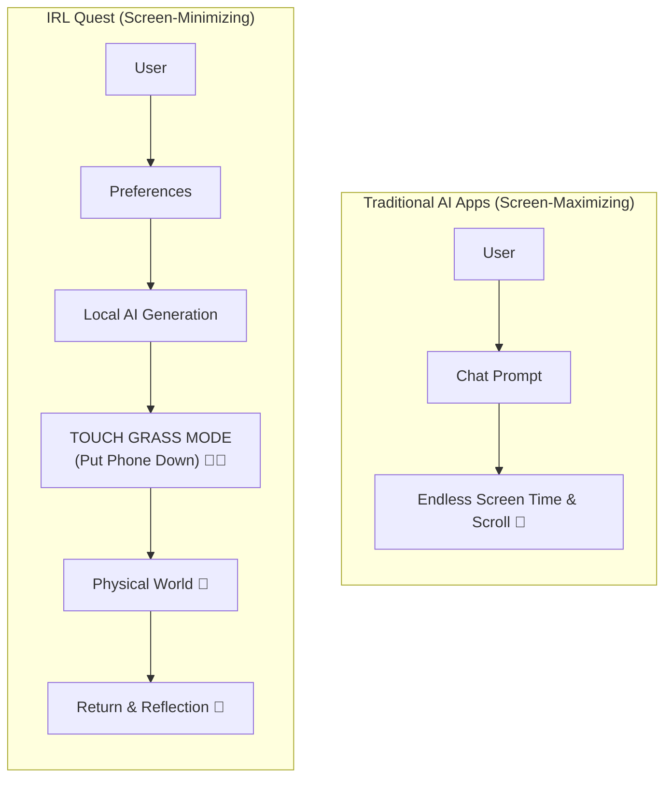
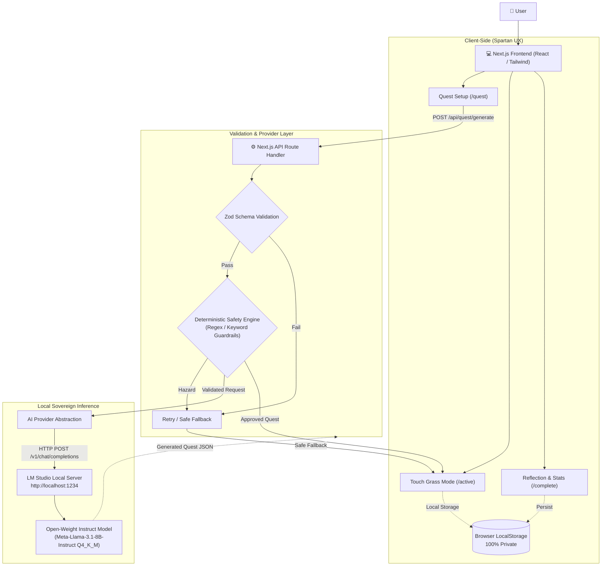

# IRL Quest 🌿

> **AI that gives you a reason to put your phone down.**  
> Built for the **Hacktoberfest Open-Source AI Challenge — Week 1: Touch Grass**

[](LICENSE)
[](https://nextjs.org/)
[](https://lmstudio.ai/)
[](#privacy-first-architecture)

---

## What is IRL Quest?

Most modern AI applications are designed to maximize screen time, engagement metrics, and conversational stickiness. 

**IRL Quest** does the exact opposite. It uses a locally running open-weight language model to generate spontaneous, low-friction micro-adventures in the physical world. The moment your quest is generated, the app enters **Touch Grass Mode**—a hyper-minimal countdown screen that tells you to put your phone away and step outside. When you return, you record a brief reflection, archived 100% privately in your browser.



> **The successful user spends less time using the application, not more.**

---

## Key Features

* **⚡ Local-First Open-Weight AI:** Powered by open-weight models (e.g., Llama 3.1 8B, Qwen 2.5 7B, Mistral 7B) running locally via [LM Studio](https://lmstudio.ai/) or Ollama. Zero cloud API calls, zero per-request costs.
* **🛡️ Deterministic Safety Guardrails:** AI-generated objectives are strictly inspected by a deterministic regex/keyword code filter that intercepts hazardous activities (trespassing, traffic, hazardous plants, dangerous heights) before anything reaches your screen.
* **📵 Touch Grass Mode:** An intentional anti-distraction interface with an ambient countdown timer and one message: *"Put your phone away. Go explore."*
* **📓 Sovereign Local Journal:** Your completed quests, timestamps, and personal reflections are stored directly in your browser (`localStorage`). No accounts, no cloud database, zero telemetry.
* **📊 Minimalist Statistics:** Tracks outdoor minutes and quests completed without predatory streak counters or gamified badges.

---

## Technical Architecture



---

## Prerequisites

1. **Node.js:** `v18.18+` or `v20+`
2. **Local Inference Server:**
   * Recommended: [LM Studio](https://lmstudio.ai/)
   * Alternative: [Ollama](https://ollama.ai/)
3. **An Open-Weight Instruct Model:**
   * Recommended: `Meta-Llama-3.1-8B-Instruct-GGUF` (Q4_K_M)
   * Lightweight fallback: `Phi-3.5-mini-instruct-GGUF`

---

## Quick Start (Local AI Mode)

### 1. Start Your Local Inference Engine
1. Launch **LM Studio**.
2. Download `Meta-Llama-3.1-8B-Instruct-GGUF` (or your preferred instruct model).
3. Open the **Local Server** tab (`<->` icon).
4. Select the model and click **Start Server** on port `1234`.

### 2. Clone & Setup IRL Quest
```bash
git clone https://github.com/your-username/irl-quest.git
cd irl-quest
npm install
```

### 3. Configure Environment
Create a `.env.local` file:
```bash
cp .env.example .env.local
```

Default settings:
```env
LOCAL_AI_BASE_URL=http://localhost:1234/v1
LOCAL_AI_MODEL=Meta-Llama-3.1-8B-Instruct
NEXT_PUBLIC_APP_MODE=local
```

### 4. Run the Application
```bash
npm run dev
```
Open [http://localhost:3000](http://localhost:3000) in your browser. Disconnect your internet connection to verify that everything runs 100% offline!

---

## Local AI Mode vs. Hosted Demo Mode

| Feature | Local AI Mode (`npm run dev`) | Hosted Web Demo (e.g. Vercel) |
| :--- | :--- | :--- |
| **Inference Source** | Local LM Studio on your machine | Curated open-weight fallback catalog |
| **Generation Type** | Dynamic, infinite variations | Deterministic preview mode |
| **Network Requirement** | **100% Offline Capable** | Requires web connection for assets |
| **Data Storage** | Local browser storage | Local browser storage |

> **Note on Cloud Demos:** A cloud-hosted Vercel instance cannot directly communicate with `http://localhost:1234` on your computer due to browser security models and container networking. The hosted demo demonstrates the UI and architecture using a deterministic sandbox preset.

---

## Repository Structure

```text
irl-quest/
├── app/
│   ├── page.tsx            # Landing view
│   ├── quest/
│   │   └── page.tsx        # Quest configuration screen
│   ├── active/
│   │   └── page.tsx        # Touch Grass Mode (Timer & Objective)
│   ├── complete/
│   │   └── page.tsx        # Reflection & completion screen
│   ├── journal/
│   │   └── page.tsx        # Local quest journal & export
│   └── api/
│       ├── health/route.ts # LM Studio connectivity check
│       └── quest/route.ts  # Generation, schema check & safety filter
├── components/
│   ├── QuestConfigForm.tsx # Category, duration & difficulty selector
│   ├── TouchGrassMode.tsx  # Distraction-free active quest view
│   ├── QuestTimer.tsx      # Low-power countdown timer
│   ├── ReflectionCard.tsx  # Post-quest reflection input
│   └── JournalFeed.tsx     # Past quest cards
├── lib/
│   ├── ai/
│   │   ├── provider.ts     # AIProvider interface
│   │   ├── lmstudio.ts     # LM Studio client
│   │   ├── prompts.ts      # Modular prompt templates
│   │   └── sanitizer.ts    # JSON fence stripping & parsing
│   ├── safety/
│   │   ├── dictionary.ts   # Prohibited hazard patterns
│   │   └── validator.ts    # Deterministic safety inspection
│   └── storage/
│       └── journal.ts      # LocalStorage persistence helpers
├── docs/
│   ├── PRODUCT.md          # Product specification & vision
│   ├── ARCHITECTURE.md     # System architecture & deployment reality
│   ├── AI.md               # Model guide, prompt architecture & JSON schema
│   ├── SAFETY.md           # Threat model & deterministic guardrails
│   └── ROADMAP.md          # 6-day sprint plan & submission details
├── .env.example
├── package.json
└── README.md
```

---

## Comprehensive Documentation

For exhaustive technical blueprints, consult the `/docs` directory:
* [Product Specification](docs/PRODUCT.md) — Product vision, USP, target users, and MVP boundaries.
* [Architecture Blueprint](docs/ARCHITECTURE.md) — System design, data flow, and provider abstraction.
* [AI & Prompt Architecture](docs/AI.md) — Model requirements, prompt templates, and structured JSON contracts.
* [Deterministic Safety Model](docs/SAFETY.md) — Threat models, regex dictionary, and retry protocol.
* [Implementation Roadmap](docs/ROADMAP.md) — 6-day sprint schedule, outdoor testing, and submission plan.

---

## Non-Goals (Scope Boundaries)

To ship a reliable, high-craft project within a 6-day sprint, IRL Quest intentionally excludes:
* ❌ Cloud user accounts and passwords
* ❌ Remote cloud databases and telemetry
* ❌ Social feeds, friends lists, and leaderboards
* ❌ GPS tracking, maps, and geofencing
* ❌ Camera/photo completion verification
* ❌ Push notifications urging you back to your screen

---

## License

This project is open-source and released under the [MIT License](LICENSE).
# irl-quest

