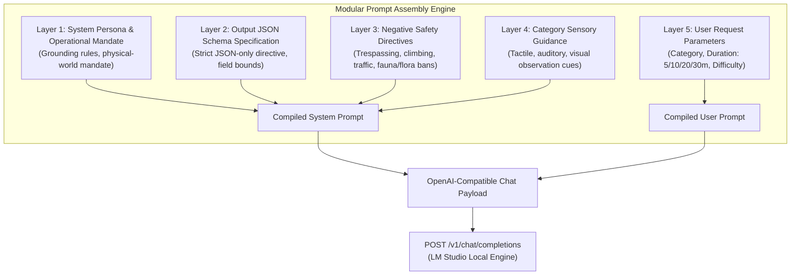

# IRL Quest — AI Specification & Prompt Architecture

> **Inference Philosophy:** Sovereign, Local, Open-Weight Intelligence  
> **Primary Inference Server:** LM Studio (OpenAI-compatible local REST endpoint)  
> **Output Paradigm:** Deterministic Structured JSON Schema

---

## 1. Why Local AI Matters for IRL Quest

The choice of local, open-weight AI over hosted cloud APIs (such as OpenAI, Anthropic, or Google Cloud) is not an ideological posture—it is an architectural necessity dictated by the specific requirements of IRL Quest.

### 1.1 Absolute Privacy of Personal Habits & Reflections
Scavenger hunts and mindfulness activities take place in a user's private living space, residential neighborhood, or personal sanctuary. Reflections recorded after a quest often contain personal insights, emotional disclosures, or descriptions of domestic surroundings. Routing these observations through third-party proprietary APIs exposes intimate routines to remote logging, analytics, and commercial training corpora. Local inference guarantees that zero user data ever leaves the device.

### 1.2 True Offline Operation in the Physical World
The core thesis of "Touch Grass" is encouraging users to step outside. Outside environments frequently feature degraded mobile coverage, intermittent Wi-Fi, or no network access at all (e.g., public parks, hiking trails, rural areas). When IRL Quest runs on local hardware, quests can be generated in full airplane mode with zero WAN dependency.

### 1.3 Zero Per-Request Marginal Cost
Commercial APIs levy per-token inference charges. For a hobbyist application or open-source community tool, cloud API keys create financial liabilities, rate-limiting friction, and quota bottlenecks. Running local open-weight models allows unlimited generation cycles for $0 in API costs.

### 1.4 Model Freedom and Anti-Lock-in
Proprietary models are continuously updated, altered, or deprecated behind opaque endpoints. An application tethered to a proprietary API can experience subtle behavioral regressions without warning. With open-weight models, users and developers can pin exact model revisions, customize quantizations, or switch between model families (Llama, Mistral, Qwen, Phi) without rewriting application code.

### 1.5 Customization and Local Experimentation
Local models grant developers complete autonomy over inference parameters (temperature, repetition penalties, context limits, sampling strategies) and prompt structures without content filtering interference on completely benign creative activities.

---

## 2. Technical Taxonomy: Open-Source vs. Open-Weight Models

In the technical documentation and public positioning of IRL Quest, precision regarding licensing is paramount. We explicitly distinguish between:

| Concept | Definition | Examples | Status in IRL Quest |
| :--- | :--- | :--- | :--- |
| **Open-Source Software (OSS)** | Source code licensed under an OSI-approved license (e.g., MIT, Apache 2.0). Anyone can inspect, modify, and redistribute code without restriction. | Next.js (MIT), React (MIT), Tailwind CSS (MIT), IRL Quest codebase (MIT). | The application codebase itself is 100% Open-Source under the MIT license. |
| **Open-Weight Models** | Model weights are publicly released and can be downloaded, inspected, quantized, and executed locally on private hardware. However, weights are governed by custom licenses that may include commercial restrictions or acceptable use clauses. | Meta Llama 3.1 (Llama 3 Community License), Google Gemma 2 (Gemma Terms of Use), Qwen 2.5 (Apache 2.0 or Qwen License). | IRL Quest is powered by local **open-weight models**. We avoid calling models "open source" unless their full training dataset, recipe, and weights are OSI-compliant. |
| **Proprietary / Closed AI** | Weights and architecture are private. Access is restricted exclusively to commercial REST endpoints with per-token billing and remote logging. | OpenAI GPT-4o, Anthropic Claude 3.5 Sonnet, Google Gemini Pro. | Not used in core architecture; defeats the local-first, offline, and privacy goals. |

---

## 3. Supported Local Inference Engines & Hardware Profiles

IRL Quest interacts with local models via the standardized OpenAI Chat Completions API format (`POST /v1/chat/completions`). Any engine providing this interface is natively supported.

### 3.1 Primary Development Target: LM Studio
* **Endpoint:** `http://localhost:1234/v1`
* **Workflow:**
  1. Download and install [LM Studio](https://lmstudio.ai/).
  2. Search and download a recommended instruct model (e.g., `Meta-Llama-3.1-8B-Instruct-GGUF`).
  3. Load model into memory with GPU acceleration enabled.
  4. Start the Local Server on port `1234`.

### 3.2 Alternative Supported Engines
* **Ollama:** `http://localhost:11434/v1` (Native OpenAI compatibility layer)
* **llama.cpp server:** `http://localhost:8080/v1` (Minimalist CLI binary for low-resource environments)
* **vLLM / LocalAI:** For Linux workstations and server deployments.

### 3.3 Recommended Open-Weight Models & Quantization Targets

| Model Family | Variant | Quantization | VRAM / RAM Required | Rationale |
| :--- | :--- | :--- | :--- | :--- |
| **Meta Llama 3.1** | `8B-Instruct` | `Q4_K_M` GGUF | ~5.5 GB | **Primary Recommendation:** Excellent instruction adherence, strong creative variety, rock-solid JSON syntax generation. |
| **Qwen 2.5** | `7B-Instruct` | `Q4_K_M` GGUF | ~5.2 GB | **Runner-up:** Exceptional structured output and formatting precision. |
| **Mistral** | `7B-Instruct-v0.3` | `Q4_K_M` GGUF | ~5.1 GB | High linguistic flair and natural vocabulary for observation prompts. |
| **Phi-3.5** | `mini-3.8B-Instruct`| `Q4_K_M` GGUF | ~2.8 GB | **Lightweight Target:** Runs fluidly on integrated GPUs or CPU-only laptops (8GB RAM). |

---

## 4. Prompt Architecture & Modular Assembly

To guarantee structured conformity and high sensory immersion, the prompt is divided into five strictly separated modular layers:



### 4.1 System Prompt (Layer 1 - 4)

```text
You are IRL Quest, an expert real-world adventure designer and mindfulness guide.
Your purpose is to create short, captivating, physically grounding micro-quests that encourage people to put down their phones, step away from screens, and observe their immediate physical environment.

CRITICAL OPERATIONAL RULES:
1. Every quest MUST be completed in the physical, real world (outdoors, garden, street, park, balcony, or immediate physical surroundings).
2. The quest MUST NOT require looking at a screen, searching online, or using a phone during execution.
3. The activity MUST be achievable within the exact duration requested.
4. The activity MUST NOT require specialized equipment, tools, or money. It relies solely on human senses (vision, hearing, touch, spatial awareness).
5. The objective MUST be clear, specific, and grounded. Avoid vague platitudes like "be happy" or "relax". Give concrete sensory targets.

SAFETY DIRECTIVES:
- DO NOT generate quests involving trespassing, climbing trees/walls, heights, or dangerous terrain.
- DO NOT generate quests involving crossing busy roadways, active traffic, or railway tracks.
- DO NOT generate quests involving approaching, feeding, or handling wild animals or unfamiliar domestic animals.
- DO NOT generate quests involving picking, handling, or consuming wild plants, berries, or mushrooms.
- DO NOT generate quests in abandoned, structurally unsound, or isolated/unsafe spaces.
- DO NOT generate quests requiring interaction with strangers or nighttime hazards.
- ALL activities must be 100% legal, non-hazardous, and benign.

RESPONSE FORMAT:
You MUST respond EXCLUSIVELY with a single, valid JSON object matching the schema below.
DO NOT include any markdown preamble, introductory phrases, or postscript.
DO NOT wrap your output in conversational prose.
```

### 4.2 Schema Contract (Layer 2)

```json
{
  "title": "Short evocative title (3-5 words)",
  "category": "nature | exploration | observation | mindfulness | surprise",
  "duration_minutes": 5 | 10 | 20 | 30,
  "difficulty": "easy | medium | hard",
  "objective": "A single, clear, concrete physical-world sensory or exploratory mission (1-2 sentences).",
  "rules": [
    "Rule 1: Specifically emphasizing leaving the phone behind or putting it in a pocket.",
    "Rule 2: Concrete boundary or observational constraint.",
    "Rule 3: Non-digital focus constraint."
  ],
  "success_condition": "A clear, tangible signal indicating the mission is complete.",
  "reflection_prompt": "A thoughtful, open question to answer upon returning to the app."
}
```

### 4.3 User Request Assembly (Layer 5)

The user request compiles dynamic parameters:

```text
Generate a real-world micro-quest with the following parameters:
- Category: {category}
- Duration: {duration_minutes} minutes
- Difficulty: {difficulty}

Produce the structured JSON output now.
```

---

## 5. Exemplar Generation Payloads Across Categories

### 5.1 Nature (10 Minutes, Easy)
```json
{
  "title": "The Palette of Earth",
  "category": "nature",
  "duration_minutes": 10,
  "difficulty": "easy",
  "objective": "Find five distinctly different shades of natural green and two unique organic textures without picking any living foliage.",
  "rules": [
    "Keep your device in your pocket for the duration.",
    "Do not pull, break, or remove leaves or flowers.",
    "Inspect textures using gentle fingertips only."
  ],
  "success_condition": "Mentally identify five distinct greens and two unique leaf or bark textures.",
  "reflection_prompt": "Which green hue was the most unexpected, and where did you find it?"
}
```

### 5.2 Exploration (20 Minutes, Medium)
```json
{
  "title": "The Unnoticed Threshold",
  "category": "exploration",
  "duration_minutes": 20,
  "difficulty": "medium",
  "objective": "Walk down a street or pathway you normally pass by without entering, and identify three architectural details constructed before the digital era.",
  "rules": [
    "Put your device on silent and store it away.",
    "Stay entirely on public footpaths and sidewalks.",
    "Do not look at online maps or street guides."
  ],
  "success_condition": "Locate three pre-digital craftsmanship details (such as brick bonds, ironwork, or weather vanes).",
  "reflection_prompt": "What craftsmanship detail did you find that would never be built the same way today?"
}
```

### 5.3 Observation (5 Minutes, Easy)
```json
{
  "title": "Shadows in Motion",
  "category": "observation",
  "duration_minutes": 5,
  "difficulty": "easy",
  "objective": "Step outside onto a porch, balcony, or pathway and observe three different things cast into shadow, tracking how their edges move with the wind or light.",
  "rules": [
    "Do not check messages or notifications.",
    "Remain standing or seated in one spot for the entire five minutes."
  ],
  "success_condition": "Notice the subtle vibration or movement in at least three distinct shadows.",
  "reflection_prompt": "How did your perception of stillness change once you focused on moving shadows?"
}
```

### 5.4 Mindfulness (10 Minutes, Easy)
```json
{
  "title": "The Acoustic Horizon",
  "category": "mindfulness",
  "duration_minutes": 10,
  "difficulty": "easy",
  "objective": "Stand or sit outdoors with eyes softly focused and identify four distinct sound layers: immediate, near, distant, and atmospheric.",
  "rules": [
    "Screen off; phone completely out of hand.",
    "No headphones or audio devices.",
    "Do not label sounds as 'good' or 'bad'—simply register their presence."
  ],
  "success_condition": "Distinguish sounds originating at least 100 meters away from those occurring right next to you.",
  "reflection_prompt": "What was the furthest sound you could detect once the immediate noise faded?"
}
```

### 5.5 Surprise (15 Minutes, Medium)
```json
{
  "title": "Older Than Your Ancestors",
  "category": "surprise",
  "duration_minutes": 20,
  "difficulty": "medium",
  "objective": "Locate an object or natural entity in your immediate surroundings that was undeniably present on Earth long before you were born.",
  "rules": [
    "No internet searches or digital verification.",
    "Do not trespass onto private property.",
    "Rely solely on physical deduction and environmental clues."
  ],
  "success_condition": "Find one entity (stone, mature tree, carved lintel) that predates your lifespan.",
  "reflection_prompt": "What evidence told you this object was older than you, and how did standing next to it feel?"
}
```

---

## 6. Parsing Resilience & Inference Parameter Tuning

### 6.1 Sanitization Strategy
Open-weight instruct models can occasionally insert Markdown wrappers or trailing punctuation. The backend parser applies three levels of defensive hygiene:
1. **Fence Elimination:** Strips ````json and ```` fences.
2. **Brace Extraction:** Truncates any leading or trailing chatter by slicing between the first `{` and last `}`.
3. **Trailing Comma Cleanup:** Normalizes standard formatting quirks before `JSON.parse()`.

### 6.2 Recommended Inference Hyperparameters
```json
{
  "temperature": 0.7,
  "top_p": 0.9,
  "max_tokens": 500,
  "frequency_penalty": 0.1,
  "presence_penalty": 0.1
}
```
* **Temperature (0.7):** Balances lyrical creativity in the titles and objectives with the structural rigidity needed for strict JSON compliance.
* **Max Tokens (500):** Guarantees swift generation (sub-3 seconds on local GPUs) while preventing runaway generation loops.
