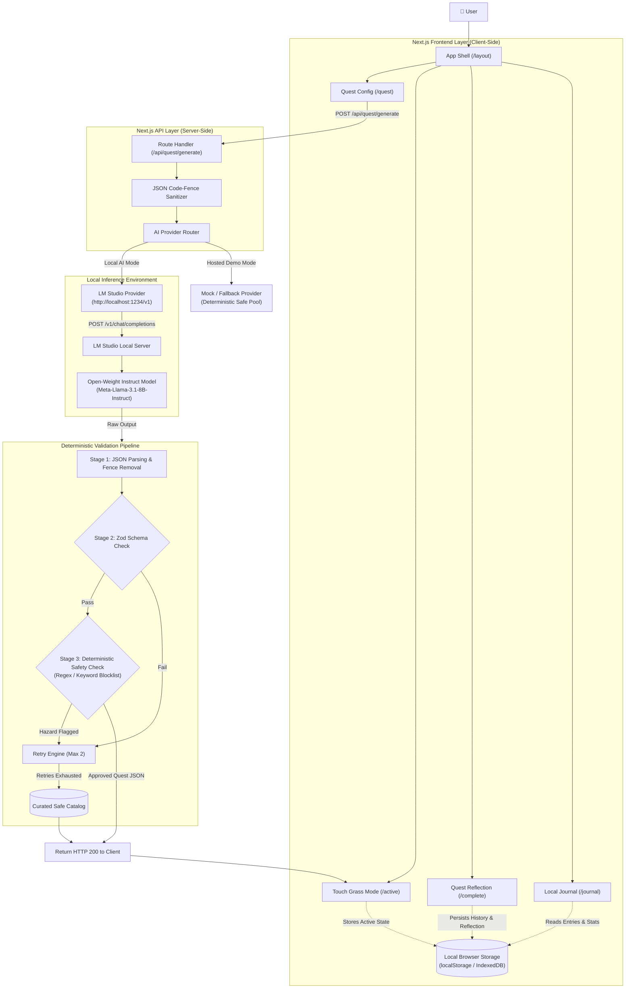
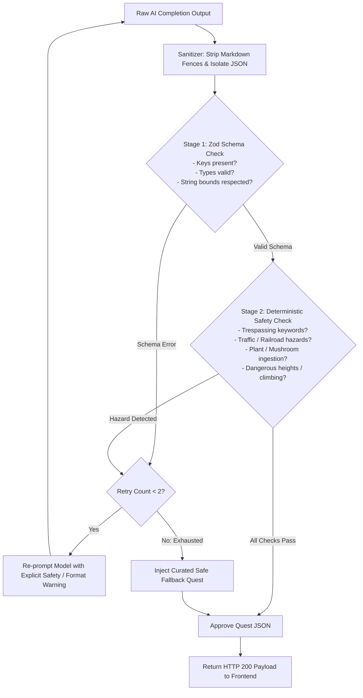
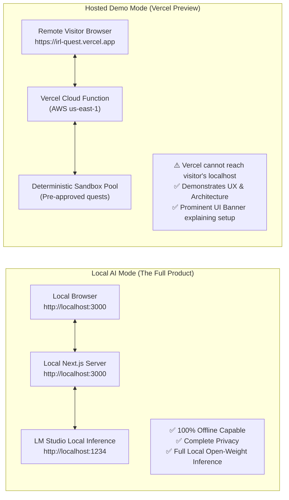

# IRL Quest — Architecture Specification

> **System Blueprint:** Local-First Physical Adventure Generation  
> **Target Runtime:** Next.js (App Router), TypeScript, Tailwind CSS, Local Inference Engine

---

## 1. High-Level System Architecture

IRL Quest uses a tiered, unidirectional architecture separating the client interface, API routing, deterministic validation, and the local inference engine.



---

## 2. Component Architecture & Routing Structure

The application is structured around the App Router paradigm in Next.js. Every route corresponds to a distinct phase of the user experience.

### Directory Mapping
```text
app/
├── layout.tsx              # Root HTML shell, typography, dark/spartan theme
├── page.tsx                # Landing view / quick start
├── quest/
│   └── page.tsx            # Quest Configuration (Category, Duration, Difficulty)
├── active/
│   └── page.tsx            # Touch Grass Mode (Timer, Minimal display, Screen down)
├── complete/
│   └── page.tsx            # Quest Completion, Reflection Input & Logging
├── journal/
│   └── page.tsx            # Local Quest Journal, history review & export
└── api/
    ├── health/
    │   └── route.ts        # Ping local LM Studio instance (/v1/models check)
    └── quest/
        └── route.ts        # Quest generation, schema validation, safety pipeline
```

### Component Breakdown
* `QuestConfigForm.tsx`: Controlled inputs for category, duration (5/10/20/30m), difficulty (Easy/Medium/Hard). Handles generation loading state.
* `TouchGrassView.tsx`: The anti-distraction screen. Renders quest objective, rules, high-contrast countdown timer, and prominent "Put phone away" indicator.
* `QuestTimer.tsx`: Low-power interval timer hook with Web Audio chime upon zero.
* `ReflectionCard.tsx`: Form for capturing user discoveries and reflections without infinite prompt fields.
* `JournalFeed.tsx`: Lightweight list of past quests persisted in local browser storage.
* `StatsSummary.tsx`: Minimalist metrics component (Quests completed, total outdoor minutes).
* `LocalAIStatusBadge.tsx`: Visual indicator displaying whether the local LM Studio instance is connected or operating in fallback mode.

---

## 3. Server API & Provider Abstraction

To ensure model agnosticism and strict separation of concerns, the backend communicates with the local inference server via an `AIProvider` interface.

### The AIProvider Interface
```typescript
// lib/ai/provider.ts

export interface QuestRequest {
  category: "nature" | "exploration" | "observation" | "mindfulness" | "surprise";
  duration_minutes: 5 | 10 | 20 | 30;
  difficulty: "easy" | "medium" | "hard";
}

export interface QuestResponse {
  title: string;
  category: string;
  duration_minutes: number;
  difficulty: string;
  objective: string;
  rules: string[];
  success_condition: string;
  reflection_prompt: string;
}

export interface AIProvider {
  name: string;
  checkHealth(): Promise<boolean>;
  generateQuest(params: QuestRequest): Promise<QuestResponse>;
}
```

### LMStudioProvider Implementation
The primary provider connects to LM Studio via its OpenAI-compatible REST endpoint (`http://localhost:1234/v1/chat/completions`).

```typescript
// lib/ai/lmstudio.ts

export class LMStudioProvider implements AIProvider {
  name = "LM Studio (Local Open-Weight)";
  private endpoint: string;

  constructor(endpoint = process.env.LOCAL_AI_BASE_URL || "http://localhost:1234/v1") {
    this.endpoint = endpoint;
  }

  async checkHealth(): Promise<boolean> {
    try {
      const res = await fetch(`${this.endpoint}/models`, { method: "GET", signal: AbortSignal.timeout(2000) });
      return res.ok;
    } catch {
      return false;
    }
  }

  async generateQuest(params: QuestRequest): Promise<QuestResponse> {
    // Generates completion using structured system prompt and parameters
    // Implements timeout and stream/complete handling
  }
}
```

### Provider Swapping
Because the interface is standardized, developers can replace `LMStudioProvider` with:
* `OllamaProvider` (pointing to `http://localhost:11434/v1`)
* `LlamaCppProvider` (pointing to `http://localhost:8080/v1`)
* `MockFallbackProvider` (for deterministic cloud preview deployments)

---

## 4. Multi-Stage Validation Pipeline

Generative models are stochastic. IRL Quest does not rely on the LLM's internal reasoning for physical safety or schema conformity.



1. **JSON Sanitizer:** Strips leading/trailing commentary, markdown fences (` ```json `), and malformed control characters.
2. **Schema Validator:** Checks presence and types of `title`, `category`, `duration_minutes`, `difficulty`, `objective`, `rules`, `success_condition`, `reflection_prompt`.
3. **Safety Validator:** Evaluates objective and rules against safety dictionaries (see `SAFETY.md`). If any rule violates physical safety constraints, the generation is rejected.

---

## 5. Storage & Persistence Architecture

The application adopts a **zero-cloud persistence** model.

### Storage Medium: Browser `localStorage`
For the MVP, `localStorage` provides instantaneous synchronous reads and writes without managing IndexedDB transaction boilerplate, perfectly matching the lightweight JSON footprint of quest logs.

### Schema Definition
```typescript
// lib/storage/types.ts

export interface SavedQuestEntry {
  id: string;               // UUID v4
  timestamp: number;        // Epoch timestamp of completion
  quest: QuestResponse;     // Generated quest details
  actualDurationSeconds: number; // Time elapsed
  reflection: string;       // User observation text
  completed: boolean;       // Status flag
}

export interface UserStats {
  totalQuests: number;
  totalMinutes: number;
  categoryCounts: Record<string, number>;
  lastCompletedDate: string | null;
}
```

---

## 6. Deployment Architecture: Local AI Mode vs. Hosted Demo

A crucial technical distinction must be maintained between the full local-first experience and cloud-hosted demonstrations.



### 6.1 Local AI Mode (The Primary Real Product)
* **Execution:** User clones the repo, installs dependencies, and runs `npm run dev`.
* **Inference:** LM Studio runs locally on `http://localhost:1234`.
* **Network:** Completely offline. Packets never leave the loopback interface (`127.0.0.1`).
* **Capabilities:** Unlimited dynamic quest generation, customized prompts, full model swapping.

### 6.2 Hosted Web Demo Mode (e.g., Vercel / Netlify)
* **Technical Reality:** A Next.js application deployed to Vercel runs serverless functions in cloud data centers (e.g., AWS us-east-1). These cloud servers **cannot connect to `http://localhost:1234`** on the visitor's machine because `localhost` from Vercel's perspective refers to the ephemeral container itself.
* **Demonstration Strategy:**
  1. **Dual Configuration UI:** The hosted interface features a setup modal allowing visitors to configure their own tunnel (e.g. ngrok / cloudflared) or toggle into **Demo Sandbox Mode**.
  2. **Demo Sandbox Mode:** Employs the `MockFallbackProvider` with a curated pool of deterministic, open-weight-generated quests.
  3. **Prominent UI Banner:** Explicitly clarifies:
     > *"You are viewing the hosted demo preview. For live local inference with open-weight models, run IRL Quest locally via `npm run dev` with LM Studio."*

This approach ensures complete technical honesty without misleading hackathon judges or users about cloud-to-localhost networking.
