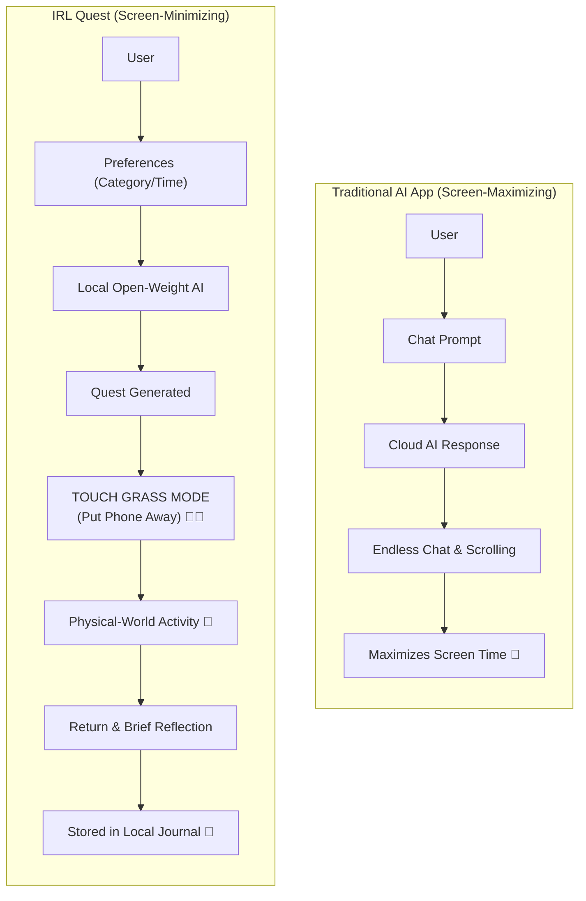
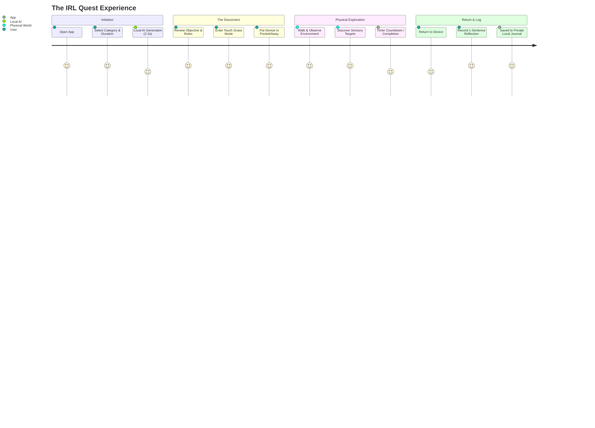

# IRL Quest — Product Specification

> **Tagline:** *AI that gives you a reason to put your phone down.*  
> **Challenge:** Hacktoberfest Open-Source AI Challenge — Week 1: *Touch Grass*  
> **Target Release:** October 2026 (6-Day MVP Sprint)  
> **Repository:** `irl-quest`  
> **License:** MIT (Application Code)

---

## 1. Executive Summary & Product Vision

Modern consumer applications and artificial intelligence interfaces are architected to maximize digital engagement: lengthening session durations, increasing scroll depth, and fostering habitual reliance on high-refresh-rate displays. Conversational AI has largely exacerbated this dynamic, trapping users in open-ended dialogues with digital personas.

**IRL Quest** rejects this paradigm. It is a local-first, privacy-preserving real-world quest generator powered by open-weight instruct language models running directly on the user's personal hardware. The application dynamically generates context-aware, low-friction micro-adventures designed to immerse users in their immediate physical surroundings—whether that is a quiet neighborhood street, an urban park, a shared courtyard, or a modest backyard.

The moment the quest is generated, IRL Quest transitions into **Touch Grass Mode**—an intentionally spartan, distraction-free screen that tells the user to put their device away and embark on their mission. Upon completing the quest, the user returns to record a brief reflection, archived entirely in local browser storage.

---

## 2. Core Product Philosophy

### The Inverted Engagement Principle
> **"The successful user spends less time using the application, not more."**

Traditional applications measure success through DAU/MAU ratios, session length, and screen time. IRL Quest measures success by how swiftly and effectively it ejects the user from digital cyberspace into the physical world.

### Engagement Loop Comparison

### Core Design Principles

1. **Short-Lived Utility, Long-Lived Experience:** AI exists solely as a creative catalyst to break cognitive inertia and decision paralysis. Once the objective is set, the software steps aside.
2. **Anti-Chatbot Architecture:** No conversational threads, no anthropomorphic chatbot companions, no autocomplete suggestions that lure the user into ongoing digital banter.
3. **Physical-World Agency:** The physical environment is the medium of discovery. Quests emphasize sensory engagement—sight, sound, texture, memory, and presence.
4. **Zero Dark Patterns:** No streak counters that penalize missing a day, no notifications begging the user to reopen the app, and no social feeds competing for attention.
5. **Absolute Data Sovereignty:** A user's physical habits, location notes, and personal reflections belong strictly to them. They never touch third-party cloud servers or training pipelines.

---

## 3. Unique Selling Proposition (USP)

### Primary USP Statement
> **IRL Quest uses local open-weight AI to dynamically create personalized real-world quests, then deliberately removes itself from the user's attention so they can complete them in the physical world.**

### The Core Differentiation
The value proposition is not simply *"an AI that generates outdoor activities."* Static lists of outdoor tasks have existed for decades. The core breakthrough is:

> **AI generates the mission; the real world is where the experience happens.**

By running open-weight models locally, IRL Quest achieves unprecedented dynamism without compromising privacy, requiring subscriptions, or depending on cloud connectivity.

### Value Differentiation Matrix

| Dimension | Generic AI Chatbot (e.g. ChatGPT, Claude) | Static Activity / Scavenger Apps | IRL Quest |
| :--- | :--- | :--- | :--- |
| **Primary Goal** | Keep user chatting; maximize engagement | Check off predetermined lists | Generate a mission and dismiss the user to reality |
| **Generation Engine** | Cloud LLM with open-ended conversational prose | Hardcoded static database entries | Locally running open-weight model with structured JSON |
| **UI Philosophy** | Chat feed, infinite scroll, rich media preview | Badges, leaderboards, social feeds, ads | **Touch Grass Mode**: Minimal countdown, "Put phone away" |
| **Privacy & Cost** | Requires network, cloud account, per-token or subscription cost | Ad-supported or accounts required | 100% offline-capable, $0 per-request cost, zero telemetry |
| **Safety Model** | Relies on opaque cloud guardrails | Pre-filtered static strings | Two-stage: Prompt constraints + deterministic code validator |

---

## 4. End-to-End User Journey

---

## 5. Target User Personas & Use Scenarios

### Persona 1: The Screen-Fatigued Knowledge Worker (Alex, 31)
* **Background:** Software engineer or digital marketer working 9–10 hours a day in front of multi-monitor setups.
* **Pain Point:** Feels mental burnout and cognitive exhaustion at the end of the workday. Desires a quick break outside, but defaults to doomscrolling social media when sitting on the porch.
* **Journey:** Opens IRL Quest, selects *Mindfulness* + *10 minutes* + *Easy*. Receives a quest to locate five distinct shades of green and listen for three non-mechanical sounds. Alex turns off the monitor, takes a 10-minute walk around the block, returns refreshed, notes one sentence in the reflection box, and closes the laptop.

### Persona 2: The Urban Micro-Explorer (Maya, 24)
* **Background:** Graduate student living in a dense urban neighborhood whose daily walking route has become monotonous and robotic.
* **Pain Point:** Boredom with familiar surroundings; wants low-effort ways to cultivate mindful awareness without spending money.
* **Journey:** Chooses *Exploration* + *20 minutes* + *Medium*. The local model generates: *"Find three architectural details built before 1980 that you have walked past every day without noticing."* Maya activates Touch Grass Mode, leaves the phone in her coat pocket, and explores a side alley.

### Persona 3: The Privacy-Conscious Outdoor Enthusiast (David, 42)
* **Background:** Privacy advocate who avoids proprietary cloud assistants and refuses to install tracking-heavy fitness or scavenger hunt apps.
* **Pain Point:** Wants spontaneous creativity for short walks with his kids without telemetry or corporate data harvesting.
* **Journey:** Runs IRL Quest on a laptop running LM Studio with an open-weight instruct model. Operates completely in airplane mode while camping or in rural spots.

---

## 6. MVP Feature Scope

Given the **6-day development window** for Hacktoberfest Week 1, the MVP features are tightly focused on an end-to-end polished experience.

### 6.1 Quest Configuration Screen
* **Category Selection (Single Select):**
  * `Nature`: Flora, fauna, natural elements, weather, sky, organic textures.
  * `Exploration`: Unfamiliar pathways, architectural quirks, hidden corners.
  * `Observation`: Patterns, contrasting colors, textures, shadows, silhouettes.
  * `Mindfulness`: Auditory landscape, physical presence, slow pacing, breathing.
  * `Surprise`: Whimsical, creative cross-disciplinary prompts.
* **Duration Selection:**
  * `5 minutes`: Immediate micro-break (e.g., backyard, balcony, front door).
  * `10 minutes`: Short block walk or garden stroll.
  * `20 minutes`: Dedicated neighborhood exploration.
  * `30 minutes`: Extended excursion or deep contemplative walk.
* **Difficulty Selection:**
  * `Easy`: Readily achievable anywhere without strain.
  * `Medium`: Requires focused attention or minor physical navigation.
  * `Hard`: Requires acute observation and creative interpretation.
* **Generate Button:** Dispatches request to the local API endpoint with loading feedback and error recovery.

### 6.2 Structured AI Quest Engine
* Calls the local OpenAI-compatible endpoint (LM Studio).
* Employs system instructions enforcing strict JSON output conforming to the quest schema.
* Enforces single-objective, non-digital, physically grounding activities.

### 6.3 Deterministic Safety & Validation Layer
* Validates returned JSON schema (keys, types, non-empty values).
* Executes regex and token-based safety filters to intercept hazardous directives (trespassing, dangerous climbing, traffic, wildlife handling, nighttime hazards).
* Automatic retry trigger if safety validation fails (up to 2 retries) before delivering a guaranteed safe fallback quest.

### 6.4 Touch Grass Mode (The Core UX)
* High-contrast, hyper-minimal interface.
* Displays:
  * Quest Title & Category badge.
  * Core Objective & Rules (bulleted).
  * Ambient countdown timer for the selected duration.
  * Bold call-to-action: **"PUT YOUR PHONE AWAY. GO EXPLORE."**
  * Discreet manual override controls: "Return Early" / "Abandon Quest".
* Zero animations, feeds, or chat bars. Screen is designed to be locked or set down.

### 6.5 Quest Completion & Reflection
* Triggered automatically upon timer completion (gentle browser chime/visual transition) or user return button.
* Header: **"QUEST COMPLETE"**
* Subheading: *"What did you discover in the physical world?"*
* Displays the specific `reflection_prompt` generated by the model.
* Free-form text area for brief user notes (1–3 sentences).
* Action buttons: "Save to Journal", "Skip Reflection".

### 6.6 Local Journal & Statistics
* **Journal View:** Chronological list of completed quests stored in `localStorage`/`IndexedDB`.
  * Quest Card: Title, category tag, date/time, duration, objective, user reflection.
  * Action: Delete entry or export journal as JSON.
* **Minimalist Stats Dashboard:**
  * Total Quests Completed.
  * Total Outdoor Minutes Logged.
  * Favorite Category.
  * No vanity streaks, no badges, no social leaderboards.

---

## 7. Explicit Non-Goals (Scope Boundary for 6-Day Sprint)

To ensure shipping a reliable, high-craft project within 6 days, the following features are strictly **out of scope**:

1. **User Authentication & Accounts:** No OAuth, email passwords, or JWTs. All data is stored in the user's browser.
2. **Cloud Database & Sync:** No Supabase, Firebase, DynamoDB, or remote storage.
3. **Social Features & Leaderboards:** No friends list, sharing feeds, upvoting, or public profiles.
4. **GPS, Maps & Geofencing:** No Google Maps API, Mapbox, or device coordinates. Quests are observational and universal rather than map-dependent.
5. **Computer Vision & Photo Verification:** Users are deliberately discouraged from taking out their phone camera to "prove" completion. The honour system reinforces intrinsic mindfulness.
6. **Push Notifications & Background Geolocation:** No service worker push pings urging the user to return to the screen.
7. **Vector Databases & RAG:** Quest generation relies on direct zero-shot parameterization of instruct models, avoiding vector store maintenance.
8. **Fine-Tuning:** Uses off-the-shelf open-weight instruct models (Llama 3.1, Mistral, Qwen 2.5).
9. **Native Mobile App Builds:** Built as a responsive mobile-friendly web application, not a compiled iOS/Android binary.

---

## 8. Metrics of Success

1. **Digital Minimization:** User session time on the screen is under 60 seconds before initiating Touch Grass Mode, and under 90 seconds during reflection.
2. **Local Inference Latency:** Quest generation completed within 2–5 seconds on consumer hardware (e.g. Apple Silicon M-series, Nvidia RTX 3060+, or modern Intel/AMD CPU with Q4 quantizations).
3. **Safety Pass Rate:** 100% of generated quests comply with physical safety guardrails via deterministic filtering.
4. **Offline Resilience:** 100% functional without an active WAN internet connection when paired with a local LM Studio instance.
