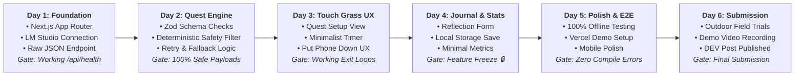

# IRL Quest — Six-Day Implementation Roadmap & Submission Strategy

> **Sprint Duration:** 6 Calendar Days  
> **Target Event:** Hacktoberfest Open-Source AI Challenge — Week 1: *Touch Grass*  
> **Sprint Rule:** Strict feature-freeze at Day 4; Days 5 & 6 reserved exclusively for stabilization, testing, field trials, and submission assets.

---

## 1. Six-Day Implementation Schedule

---

### Day 1: Foundation, Local AI Connectivity & Structured Generation
* **Morning Objectives:**
  * Initialize Next.js 14/15 App Router project (`npx create-next-app@latest` with TypeScript, Tailwind CSS, ESLint).
  * Configure spartan visual styling, dark color tokens, and clean typography.
  * Establish `.env.example` and environment variables for local inference (`LOCAL_AI_BASE_URL=http://localhost:1234/v1`).
* **Afternoon Objectives:**
  * Implement `lib/ai/provider.ts` and `lib/ai/lmstudio.ts`.
  * Create `/api/health` route checking connectivity with local LM Studio instance (`/v1/models`).
  * Implement base `/api/quest/generate` route issuing test completions with Llama 3.1 8B Instruct.
* **Day 1 Deliverable / Gate:** A successful curl or frontend button triggering local LM Studio inference and printing raw structured JSON in the console.

---

### Day 2: Quest Engine, Schema Enforcement & Deterministic Safety Layer
* **Morning Objectives:**
  * Implement Zod schema for `QuestResponse` (`lib/quests/schema.ts`).
  * Implement prompt assembly with system instructions, user parameters, and JSON-only directives (`lib/ai/prompts.ts`).
  * Implement JSON sanitization to reliably strip Markdown fences and malformed characters (`lib/ai/sanitizer.ts`).
* **Afternoon Objectives:**
  * Implement regex dictionary and deterministic evaluation engine (`lib/safety/dictionary.ts`, `lib/safety/validator.ts`).
  * Wire up two-tier retry mechanism (re-prompting on safety hazard flags) and curated safe fallback injection.
  * Build unit tests verifying that hazardous prompt outputs (e.g. climbing cliffs, trespassing, eating wild mushrooms) are intercepted and rejected.
* **Day 2 Deliverable / Gate:** The `/api/quest/generate` endpoint reliably produces validated, 100% safe, structured JSON quests with zero schema errors.

---

### Day 3: Touch Grass Mode, Countdown Engine & Minimalist UX
* **Morning Objectives:**
  * Build the Quest Setup interface (`app/quest/page.tsx` + `QuestConfigForm.tsx`): Category selector, Duration pills (5/10/20/30 min), Difficulty pills.
  * Implement Quest Review state before launch (Title, Objective, Rules preview).
* **Afternoon Objectives:**
  * Build **Touch Grass Mode** (`app/active/page.tsx` + `TouchGrassMode.tsx`).
  * Implement the countdown timer with low-power background interval handling.
  * Design the screen-minimizing visual layout: bold warning ("Put your phone away. Go explore."), high contrast, dark backdrop, zero distractions.
  * Add discrete "Return Early" and "Abandon Quest" fail-safes.
  * Synthesize a gentle completion audio tone using the Web Audio API (eliminates external MP3 asset dependencies).
* **Day 3 Deliverable / Gate:** A user can configure a quest, launch Touch Grass Mode, see the countdown, lock their device, and transition smoothly to completion upon timer expiration.

---

### Day 4: Quest Completion, Reflection, Local Storage & Simple Stats
* **Morning Objectives:**
  * Build the Completion & Reflection screen (`app/complete/page.tsx` + `ReflectionCard.tsx`).
  * Display the dynamically generated `reflection_prompt` with a focused, 1-to-3 sentence reflection textarea.
  * Create the local storage repository (`lib/storage/journal.ts`) for saving quest history to browser `localStorage`.
* **Afternoon Objectives:**
  * Build the Journal Feed view (`app/journal/page.tsx`): Chronological cards of completed missions, objectives, and reflections.
  * Build the Minimalist Stats view (`StatsSummary.tsx`): Total quests completed, total physical minutes outdoors, category distribution.
  * Add JSON export button allowing users to back up their local quest journal.
  * **Strict Feature Freeze Activated:** No new feature development permitted after Day 4.
* **Day 4 Deliverable / Gate:** Complete end-to-end user loop functioning entirely offline from configuration to journal persistence.

---

### Day 5: Polish, End-to-End Testing & Offline Verification
* **Morning Objectives:**
  * Comprehensive offline audit: Disconnect machine from Wi-Fi/Ethernet; verify quest generation, Touch Grass Mode, and journaling function seamlessly via local LM Studio loopback.
  * Edge case handling: Local server offline warnings, slow generation spinners, invalid parameter guards.
  * Cross-device responsive polish: Ensure mobile layout looks razor-sharp on smartphone viewports.
* **Afternoon Objectives:**
  * Deploy hosted web preview to Vercel with clear "Hosted Demo Mode" banner explaining cloud-to-localhost networking and featuring deterministic sandbox presets.
  * Finalize code documentation, TypeScript types, and repository `README.md`.
* **Day 5 Deliverable / Gate:** Zero TypeScript warnings, clean builds on both local and hosted environments, verified offline execution.

---

### Day 6: Outdoor Field Trials, Demo Recording & Hackathon Submission
* **Morning Objectives:**
  * Execute real-world outdoor field tests across three physical settings (Park, Residential Sidewalk, Balcony).
  * Record a 2-minute video demonstration:
    1. Setting preferences in IRL Quest.
    2. Local LM Studio terminal showing active generation with open-weight model.
    3. Entering Touch Grass Mode and physically setting the phone down.
    4. Short outdoor sequence showing user completing the objective.
    5. Returning, recording reflection, and reviewing local journal entry.
* **Afternoon Objectives:**
  * Record and submit DevRelay agent session transcript.
  * Draft and publish the official Hacktoberfest Week 1 DEV article.
  * Final repository tagging (`v1.0.0-hacktoberfest`).
* **Day 6 Deliverable / Gate:** Complete submission package published on DEV with live repository, demo video, and clear documentation.

---

## 2. Real-World Outdoor Field Testing Protocol

Prior to submission, the software must be tested in genuine outdoor environments to validate physical UX ergonomics.

### Test Matrix
1. **Setting A: Urban Sidewalk / Street**
   * *Selection:* Exploration, 10 Minutes, Medium.
   * *Verification:* Does the quest provide enough spatial freedom without requiring navigation aids? Does it avoid jaywalking or trespassing cues?
2. **Setting B: Public Park / Green Space**
   * *Selection:* Nature, 15 Minutes, Easy.
   * *Verification:* Does the quest focus on organic textures and observation without suggesting harmful plant picking or animal disturbance?
3. **Setting C: Domestic Balcony / Porch**
   * *Selection:* Mindfulness, 5 Minutes, Easy.
   * *Verification:* Is the activity doable in a restricted footprint? Does the soundscape prompt provide grounding?

---

## 3. Hacktoberfest Submission Structure & Positioning

The final submission post on DEV will adhere strictly to the Hacktoberfest Challenge guidelines:

### 3.1 What I Built
* IRL Quest: A local-first, privacy-preserving micro-quest generator designed to fight digital fatigue.
* Highlight the Inverted Engagement Loop: *"Software that succeeds when you put it down."*

### 3.2 Demo
* Link to hosted preview (with clear explanation of demo sandbox mode).
* Embedded high-definition video walkthrough showcasing the phone being placed face-down on a wooden bench while exploring outdoors.

### 3.3 Code
* Link to public GitHub repository under MIT license.
* Clear instructions for running locally with LM Studio and Llama 3.1 8B.

### 3.4 How I Built It
* **Stack:** Next.js, React, Tailwind CSS, TypeScript.
* **AI Layer:** Local LM Studio running Meta-Llama-3.1-8B-Instruct (Q4_K_M) via OpenAI-compatible loopback endpoint.
* **Safety:** Deterministic multi-stage regex and keyword filtration engine.
* **Storage:** Zero-cloud, 100% private browser persistence.

### 3.5 Why Open Innovation Matters
* **Personal Data Sovereignty:** Daily physical habits and private reflections should not train commercial ad models.
* **Resilience:** Software that works off-grid in nature without cellular data.
* **Democratization:** Consumer PCs running open-weight models at zero marginal cost.

### 3.6 DevRelay Session & Submission Tagging
* Embed the interactive DevRelay coding transcript.
* Tags: `#hacktoberfest`, `#ai`, `#opensource`, `#webdev`.

---

## 4. Post-Hackathon Roadmap (v1.1 - v2.0)

Features explicitly deferred from the 6-day MVP:

* **v1.1 — Ambient Audio Cues:** Synthesize subtle auditory pulses or bell chimes at halfway mark and completion so the user never has to peek at their screen in their pocket.
* **v1.2 — Progressive Web App (PWA) Offline Shell:** Full Service Worker caching enabling installation on mobile homescreens with zero internet requirement.
* **v1.3 — Local Voice Reflections:** Integrate local Whisper (via WebGPU or whisper.cpp) for spoken audio reflections converted locally to journal text.
* **v2.0 — Curated Quest Packs:** Community-contributed thematic quest rulesets (e.g., Night Sky Astronomy, Rainy Day Puddle Quests, Architectural History).
