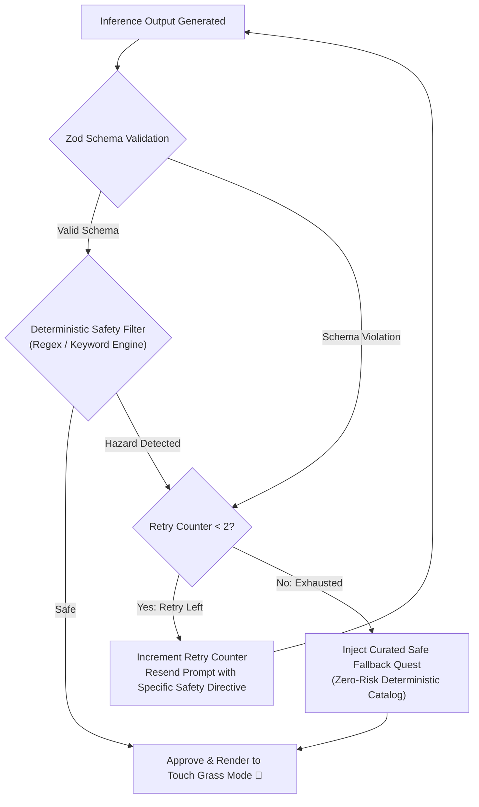

# IRL Quest — Deterministic Safety Layer & Guardrails

> **Safety Mandate:** Zero Physical Harm. Zero Stochastic Dependence.  
> **Architecture:** Two-Tier Defense (Negative System Prompting + Deterministic Regex/Keyword Code Filter + Safe Fallback Catalog)

---

## 1. Safety Philosophy

Generative Large Language Models are stochastic token predictors. While system prompts can instruct an LLM to avoid dangerous suggestions, **prompt instructions alone are fundamentally insufficient for real-world physical safety**. Models can experience subtle alignment drift, misunderstand geographical nuances, or produce playful prose that inadvertently suggests reckless physical actions.

In IRL Quest, the safety boundary is governed by an absolute architectural invariant:

> **No quest generated by the AI reaches the user interface without passing through a deterministic, hardcoded programmatic safety filter.**

If an AI-generated quest contains even a single prohibited phrase or safety hazard flag, it is discarded immediately by code before rendering.

---

## 2. Threat Modeling: Physical-World Hazards

The threat model for a real-world micro-adventure generator spans six distinct categories:

| Hazard Domain | Potential Risk | Interception Mechanism |
| :--- | :--- | :--- |
| **1. Property & Legal** | Trespassing, climbing fences, entering construction sites, private backyards, abandoned buildings, or restricted government/utility infrastructure. | Regex blocklists for property terms; explicit rules requiring public thoroughfares. |
| **2. Traffic & Transit** | Crossing multilane highways, walking along active railway tracks, running into intersections, or navigating unlit vehicular roadways. | Blocklists for roads, tracks, trains, cars, intersections. |
| **3. Botanical & Mycological** | Ingesting wild plants, foraging mushrooms, tasting berries, or touching allergenic/poisonous flora (e.g. poison ivy, sumac, nettles). | Strict ban on consumption, picking, tasting, or foraging words. |
| **4. Wildlife & Fauna** | Approaching aggressive animals, disturbing insect nests (wasps, bees), handling reptiles, or feeding wild mammals. | Blocklists for animals, nests, handling fauna, feeding wildlife. |
| **5. Heights & Terrain** | Climbing high trees, scaling walls, perching on bridges, walking along steep cliffs, or entering deep water/currents. | Blocklists for climbing, roofs, scaling, cliffs, swimming, deep water. |
| **6. Interpersonal & Nighttime** | Approaching unfamiliar people, following strangers, entering unlit alleys at night, or participating in confrontational interactions. | Interpersonal contact prohibition; sensory exploration must be solitary or observational. |

---

## 3. The Deterministic Safety Engine Implementation

The safety filter runs in the Next.js API route (`lib/safety/validator.ts`). It inspects every string field within the generated JSON (`title`, `objective`, `rules`, `success_condition`, `reflection_prompt`).

### 3.1 Prohibited Keyword & Pattern Dictionary

```typescript
// lib/safety/dictionary.ts

export const SAFETY_HAZARD_PATTERNS: { category: string; regex: RegExp }[] = [
  // 1. Property, Trespass & Illegality
  {
    category: "property_trespass",
    regex: /(trespass|private property|private yard|climb (over|a) (fence|gate|wall)|hop the fence|abandoned (house|building|factory|structure)|restricted area|construction (site|zone)|railroad|train tracks|subway tracks)/i,
  },
  // 2. Traffic & Road Hazards
  {
    category: "traffic_hazard",
    regex: /(highway|freeway|busy (street|road|intersection)|cross the (highway|freeway)|run across|traffic lane|jaywalk)/i,
  },
  // 3. Environmental & Bio Hazards (Flora / Fungi / Water)
  {
    category: "botanical_consumption",
    regex: /(eat|taste|ingest|consume|chew|swallow|forage|pick (and eat|mushrooms|berries)|poison ivy|poison oak|wild mushroom|fungus to eat)/i,
  },
  // 4. Wildlife Hazards
  {
    category: "wildlife_contact",
    regex: /(approach (the|a) (wild|bear|snake|raccoon|coyote|stray)|feed (the|a) wild|pet (the|a) strange dog|disturb (the|a) (nest|hive|wasp|bee)|catch (a|the) (snake|rodent|animal))/i,
  },
  // 5. Heights & Dangerous Physical Challenges
  {
    category: "heights_physical",
    regex: /(climb (a|to the top of a) tree|scale the wall|walk along the ledge|cliff edge|roof|rooftop|swim in (the|a) (river|canal|current)|deep water|dive into|jump from)/i,
  },
  // 6. Social & Interaction Risks
  {
    category: "social_vulnerability",
    regex: /(approach a stranger|talk to someone you don't know|follow (a|the) person|knock on (a stranger's|someone's) door|unlit alley|dark alleyway|secluded woods at night)/i,
  },
];
```

### 3.2 Evaluation Function

```typescript
// lib/safety/validator.ts
import { SAFETY_HAZARD_PATTERNS } from "./dictionary";
import { QuestResponse } from "../quests/schema";

export interface SafetyValidationResult {
  isSafe: boolean;
  violatedCategory?: string;
  matchedPattern?: string;
}

export function validateQuestSafety(quest: QuestResponse): SafetyValidationResult {
  // Aggregate all narrative text into a single inspectable corpus
  const textCorpus = [
    quest.title,
    quest.objective,
    ...quest.rules,
    quest.success_condition,
    quest.reflection_prompt,
  ].join(" ");

  for (const { category, regex } of SAFETY_HAZARD_PATTERNS) {
    const match = textCorpus.match(regex);
    if (match) {
      return {
        isSafe: false,
        violatedCategory: category,
        matchedPattern: match[0],
      };
    }
  }

  return { isSafe: true };
}
```

---

## 4. Rejection, Retry & Fallback Decision Flow

When a generated quest fails safety validation, the system initiates a bounded retry protocol:



### 4.1 Bounded Retry Logic
1. If validation fails, log the trigger (`violatedCategory: "property_trespass"`).
2. If `retryCount < 2`, issue a new inference call with an augmented constraint explicitly prohibiting the flagged concept.
3. If `retryCount >= 2`, abort inference and inject a pre-approved, curated safe fallback quest corresponding to the user's requested category.
4. **Result:** The user is never subjected to an unhandled 500 error or a hazardous quest.

---

## 5. Curated Safe Fallback Catalog

In the event of network disruption, local inference timeout, or repeated validation rejections, the engine draws from a zero-risk deterministic catalog:

### 1. Nature Fallback (`nature`, 10 min, Easy)
* **Title:** The Palette of Natural Textures
* **Objective:** Find three different natural textures (e.g., rough tree bark, smooth stone, soft moss) in your immediate outdoor area without disturbing living plants.
* **Rules:** Leave device indoors or in pocket; use gentle touch; stay within eyesight of your starting point.
* **Success Condition:** Touch three distinctly different non-synthetic textures.
* **Reflection Prompt:** Which natural texture felt the most grounding under your fingertips?

### 2. Exploration Fallback (`exploration`, 15 min, Medium)
* **Title:** The Way You Never Turn
* **Objective:** Walk out your door and take the first two turns in directions you normally never choose on your regular commute, staying on public sidewalks.
* **Rules:** Keep your phone in your pocket; stay on lit public footpaths; observe without taking photos.
* **Success Condition:** Reach a street corner you have never consciously inspected.
* **Reflection Prompt:** What was the first unfamiliar detail you noticed on this path?

### 3. Observation Fallback (`observation`, 5 min, Easy)
* **Title:** Five Unnoticed Colors
* **Objective:** Stand outdoors for five minutes and locate five items reflecting distinct natural hues of brown, green, gray, and gold.
* **Rules:** Remain stationary; keep screen off; observe purely with natural sight.
* **Success Condition:** Spot five distinct color gradations in everyday materials.
* **Reflection Prompt:** Which color was hiding in plain sight?

### 4. Mindfulness Fallback (`mindfulness`, 10 min, Easy)
* **Title:** The Listening Threshold
* **Objective:** Sit or stand quietly outside and identify three layers of sound: the nearest sound, the ambient neighborhood sound, and the furthest sound on the horizon.
* **Rules:** Eyes closed or softly cast downward; no headphones; phone locked.
* **Success Condition:** Hear at least one sound you could not detect during the first minute.
* **Reflection Prompt:** How did the ambient volume change once your attention settled?

### 5. Surprise Fallback (`surprise`, 10 min, Easy)
* **Title:** The Oldest Thing in Sight
* **Objective:** Look around your outdoor environment and find the single object, geological feature, or tree that has existed the longest.
* **Rules:** Stay on safe ground; no internet lookups; deduce age from physical wear and growth.
* **Success Condition:** Identify one physical anchor that has witnessed decades of change.
* **Reflection Prompt:** What tells you that this object has survived through time?
