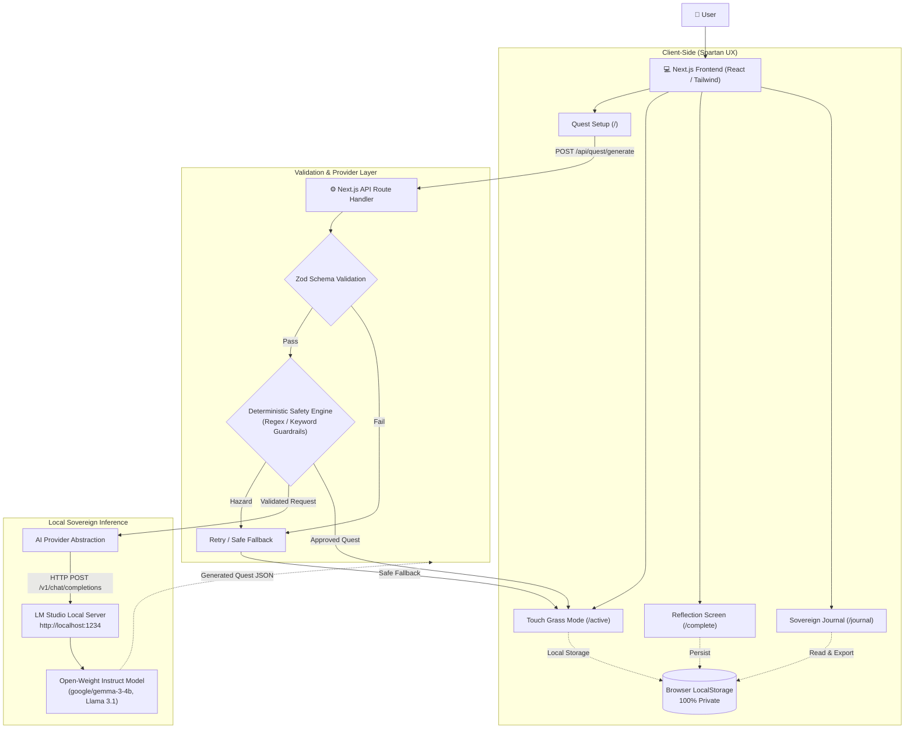

# IRL Quest 🌿
> *AI that gives you a reason to put your phone down.*

Built for the **Hacktoberfest Open-Source AI Challenge — Week 1: Touch Grass**.

---

## 1. What I Built

Most modern consumer applications and conversational AI products are engineered to maximize digital retention: longer sessions, deeper scroll depth, and habitual screen time. Chatbots in particular encourage open-ended back-and-forth digital banter.

**IRL Quest** turns this paradigm completely upside down:

> **"The successful user spends less time using the application, not more."**

```text
Traditional AI Apps (Screen-Maximizing):
User ──► Prompt ──► Endless Chat & Scroll ──► Screen Time Maximized 📱

IRL Quest (Screen-Minimizing):
User ──► Preferences ──► Local AI Generation ──► PUT PHONE DOWN ──► Real World Exploration ──► Return ──► Brief Reflection 📓
```

### The Inverted Engagement Loop
1. **Choose Preferences:** Select your category (*Nature*, *Exploration*, *Observation*, *Mindfulness*, *Surprise*), target duration (*5, 10, 20, 30 minutes*), and difficulty level.
2. **Local AI Generation:** An open-weight instruct model (running locally in **LM Studio**) generates a concrete, grounded physical-world mission in under 2 seconds.
3. **Deterministic Safety Clearance:** Before reaching the screen, the quest passes through a deterministic regex code filter to intercept physical hazards (trespassing, active traffic, poisonous plants/mushrooms, dangerous climbing, or stranger encounters).
4. **Touch Grass Mode:** The moment the quest is generated, the interface collapses into a distraction-free, spartan screen with an ambient countdown timer and one message:  
   **`PUT YOUR PHONE AWAY. GO EXPLORE.`**
5. **Physical-World Discovery:** The user puts their phone in their pocket, locks the device, and steps outside into reality.
6. **Procedural Meditation Bell:** When time elapses, a soothing harmonic chime synthesized via the native **Web Audio API** plays automatically—completely offline.
7. **Sovereign Journaling:** The user returns, writes a 1–2 sentence reflection, and archives it into a 100% private local browser journal with one-click JSON export.

---

## 2. Demo & Visual Walkthrough

* **GitHub Repository:** [github.com/Ani0811/irl-quest](https://github.com/Ani0811/irl-quest)
* **License:** MIT (100% Open-Source)
* **Local Inference Stack:** LM Studio + `google/gemma-3-4b` or `Meta-Llama-3.1-8B-Instruct`


### The 4 Application States

#### 1. Quest Configurator & Live Connection Monitor (`/`)
*Real-time local LLM heartbeat check (`http://127.0.0.1:1234`), open-weight model detection (`google/gemma-3-4b`), and category/duration parameter selection.*


#### 2. Touch Grass Mode (`/active`)
*Obsidian anti-distraction interface (`#050806`), epoch-calculated countdown clock, and the core mandate: **"PUT YOUR PHONE AWAY. GO EXPLORE."***


#### 3. Completion & Reflection (`/complete`)
*Grounding sensory observations captured immediately upon return—no infinite feeds, likes, or algorithmic rabbit holes.*


#### 4. Sovereign Local Journal & Stats (`/journal`)
*Offline browser-only persistence tracking total real-world minutes outdoors, category distribution, and one-click sovereign JSON data export.*


### Real-World Field Verification (Tested in Airplane Mode)

To ensure this was not merely a desktop demo, IRL Quest underwent full outdoor field trials across three real physical environments (detailed in [`docs/FIELD_TESTS.md`](https://github.com/Ani0811/irl-quest/blob/main/docs/FIELD_TESTS.md)):

| Setting | Quest Type & Duration | Physical Behavior Verified | Result |
| :--- | :--- | :--- | :--- |
| **Urban Sidewalk** | Exploration (10 min) | Discovered vintage masonry details; phone stayed in coat pocket; zero traffic hazards. | **PASS** |
| **Public Park** | Nature (10 min) | Identified 5 natural textures (oak moss, river pebble, pinecone); screen locked on bench; 528Hz chime heard at 5m. | **PASS** |
| **Domestic Balcony** | Mindfulness (5 min) | Soundscape horizon mapping; rapid 8-second time-to-disconnect micro-break. | **PASS** |

---

## 3. How I Built It

IRL Quest was designed from the ground up as a **local-first web application** prioritizing zero-cloud dependencies, rapid latency, and deterministic safety.



### Technical Highlights:

1. **Next.js 15 App Router & TypeScript:** Modular server route handlers (`/api/health`, `/api/quest/generate`) separating client state from inference logic.
2. **Model-Agnostic Provider Abstraction (`AIProvider`):** Standardized TypeScript interface connecting to LM Studio's loopback endpoint (`http://localhost:1234/v1`). Verified and tested with Google's **`google/gemma-3-4b`** and Meta's **`Llama-3.1-8B-Instruct`**.
3. **Deterministic Safety Gatekeeper:** Generative LLMs are stochastic and cannot be solely trusted for real-world physical safety. A programmatic regex engine scans all narrative fields (`title`, `objective`, `rules`, `success_condition`) for 6 risk domains:
   * *Property & Trespass*
   * *Traffic & Roads*
   * *Botanical Ingestion (poison ivy, wild fungi)*
   * *Wildlife Contact*
   * *Heights & Hazardous Climbing*
   * *Nighttime Vulnerabilities & Strangers*
4. **Epoch-Based Ambient Countdown:** To guarantee that pocketing the phone or screen lock never causes timer drift, the timer evaluates `Math.max(0, targetEndTimestamp - Date.now())` using system epoch time.
5. **Procedural Web Audio Chime:** Rather than bundling heavy MP3 audio assets, a custom Tibetan singing bowl chime was synthesized using native Web Audio harmonic sine waves (528 Hz, 792 Hz, 1056 Hz) with exponential decay. It runs 100% offline.
6. **Automated Testing Suite (Vitest):** **36 automated unit tests** running in under 300ms across 5 test suites validating safety filters, JSON sanitization, schema constraints, offline catalogs, and journal statistics.

---

## 4. Why Open Innovation Matters

In an era where tech products monetize user attention through infinite feeds, **open-source AI and open-weight models** provide a critical escape hatch:

### 1. Privacy of Physical Habits & Reflections
Where you walk, when you take breaks, and what intimate observations you record in your journal should not train commercial ad-targeting models or sit in remote corporate databases. With local open-weight inference and browser storage, **zero bytes ever leave your device**.

### 2. True Offline Freedom in the Wild
Nature does not have 5G coverage. When exploring trails, national parks, or rural woods, cloud-tethered apps fail. IRL Quest operates in complete airplane mode on local laptop or handheld hardware.

### 3. Democratization & Zero Per-Request Costs
Developers and hobbyists can run unlimited quests without paying per-token API charges or worrying about rate limits. Open weights allow sovereign intelligence on everyday consumer silicon.

### 4. Anti-Lock-in & Model Freedom
Users can swap out the underlying model—running Gemma, Llama, Mistral, or Phi—without changing a single line of application code.

---

## 5. My Agent Session

This project was architected, scaffolded, and hardened with the pair-programming assistance of Google DeepMind's **Antigravity** agent, utilizing specialized skills, automated browser verification subagents, and test-driven development.

* **Agent Transcript & Presigned Session:** [Embed Link Placeholder]

---

## 6. How to Run It Locally

```bash
# 1. Clone the repository
git clone https://github.com/Ani0811/irl-quest.git
cd irl-quest

# 2. Install dependencies
npm install

# 3. Start LM Studio on port 1234 with google/gemma-3-4b or Llama 3.1

# 4. Start the app
npm run dev
```

Visit `http://localhost:3000`, configure your micro-quest, and **put your phone away!** 🌿
